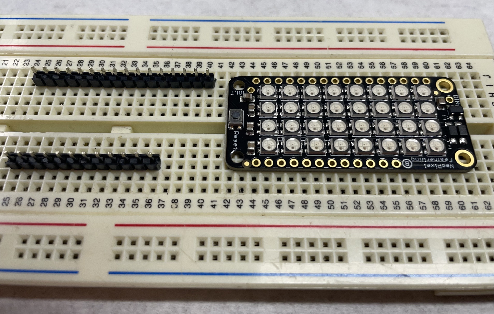
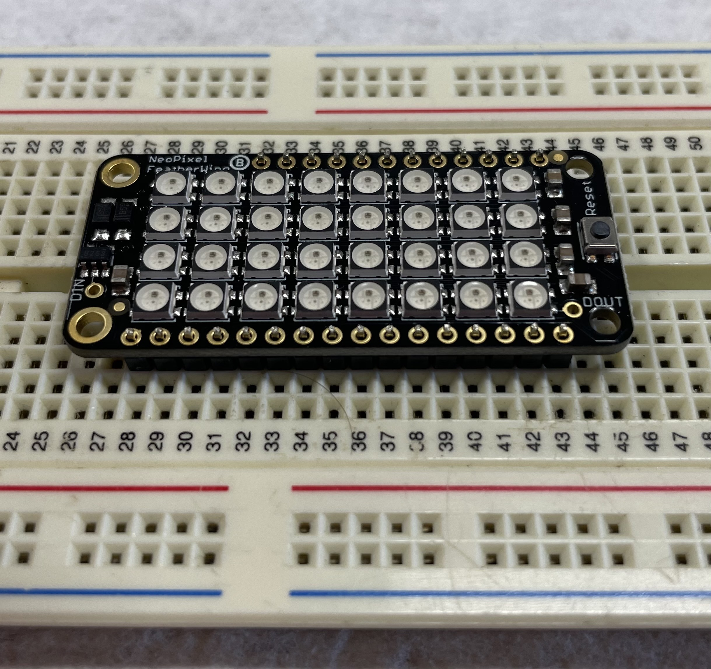
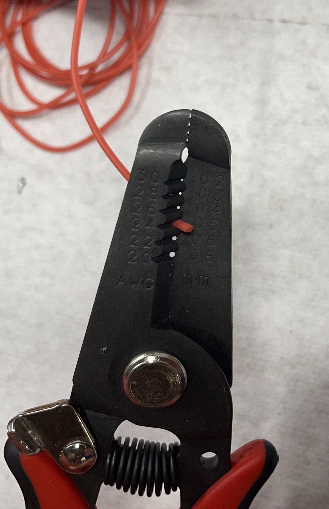
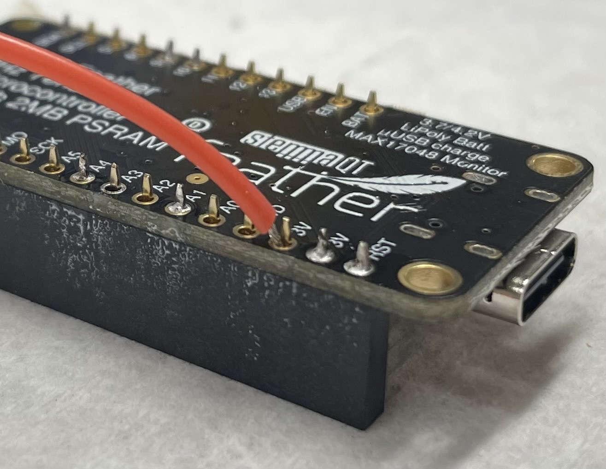
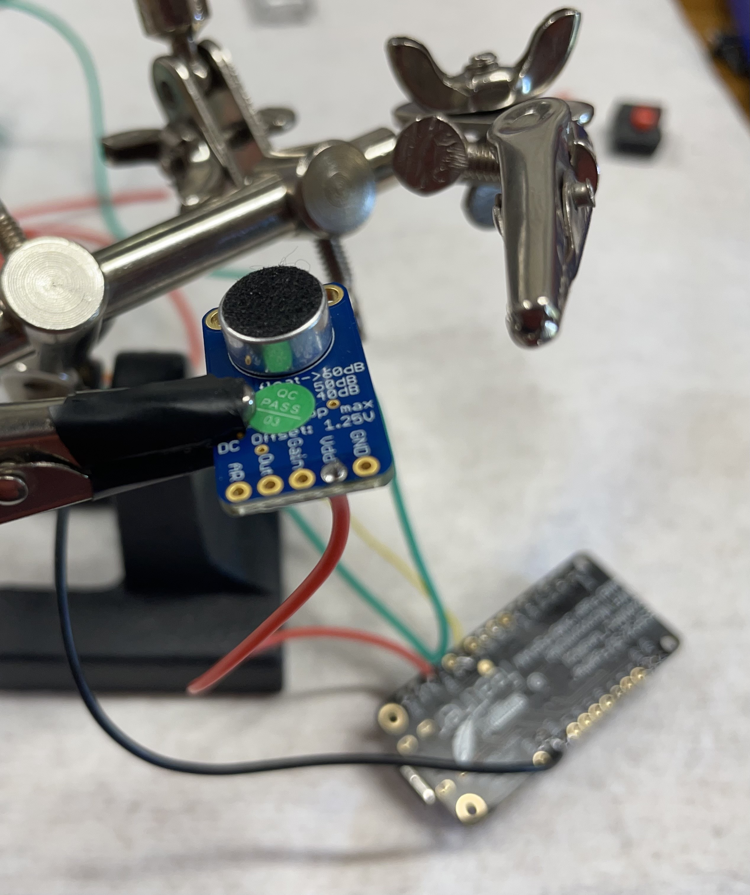
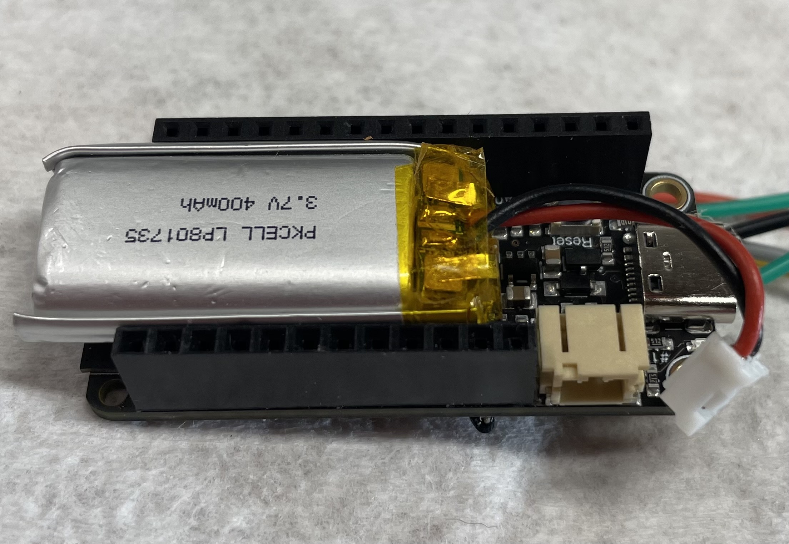
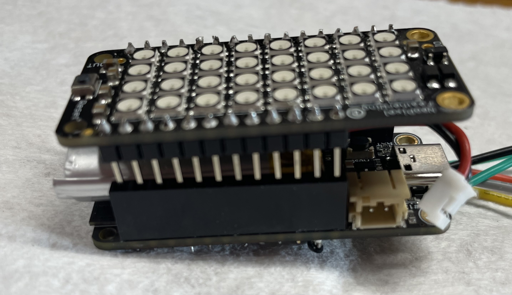
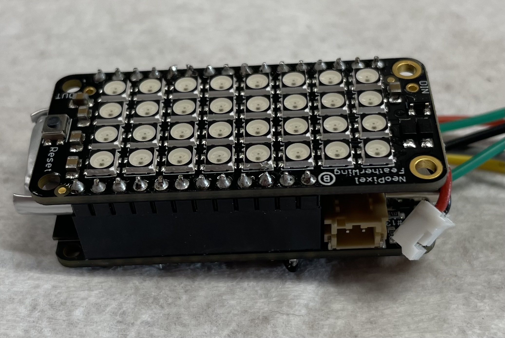

# Sound To Light

## Introduction

Sound to Light (aka Sound Delight) is a audio spectrogram display for Adafruit Feathers.  Among other uses it is a fun visual accompaniment to music.  

## Project Materials

### Hardware

Displayed from left to right in the image above

- [Male Headers](https://www.adafruit.com/product/2886)
- [NeoPixel FeatherWing](https://www.adafruit.com/product/2945)
- [Female Headers](https://www.adafruit.com/product/2940)
- [ESP32-S3 board with 2MB PSRAM](https://www.adafruit.com/product/5477).
- *Optional* [Battery](https://www.adafruit.com/product/3898)
- [Electret Microphone with Auto Gain Control](https://www.adafruit.com/product/1713)
- 0.5m of any workable gauge [wire](https://www.adafruit.com/product/2515)
- *Optional* [On/Off Switch](https://www.adafruit.com/product/1683)
- *Optional* [Mode Button](https://www.adafruit.com/product/1490)

The case is 3D printed.  If you do not own a 3D printer many towns have a local 3D printing business.  If not there are online services that will mail a print.

### Tools:
    
- Soldering Iron
- Wire strippers

### Helpful Tools:

- Helping Hands
- Breadboard
- Flush Cutters
- Board Holder

## Instructions

### 1. Solder on the male headers onto the NeoPixel Featherwing display.  

The easiest way is insert the male headers into the breadboard with the long pins down so the featherwing can rest on top. 

Place the featherwing on top of the male headers. 

 

*Note: If you do not have a breadboard, complete soldering the female headers to the ESP32-S3 from the step below, then place your male headers in the female headers to get the correct placement*

Solder each pin.  **Be very careful to not touch the NeoPixels with the iron as LEDs are sensitive to heat**  Seek help from an instructor or YouTube if you are new to soldering.  In general position the soldering iron to make full contact with the pin and try to limit contact with the pin to 2 to 3 seconds.  

### 2. Prepare the ESP32-S3 feather for wiring and soldering

If you had a breadboard, you can insert the female headers onto the neopixel headers, then rest the ESP32-S3 on top

If you did not have a breadboard, I recommend taping the female headers to the feather.  **Ensure the bottom of the board is being soldered.**

**Before soldering**, we need to add wires to the microphone.  The following pins need to be connected:

Microphone Wires (*Colors are only suggestions*)

- 3.3v (Red)   
- Ground (Green)
- A1 Input (Yellow) 
- A2 Gain (Orange)

Mode Button Wires (Optional)
- 3.3v (Red)
- D1 (Orange)
    
Strip about 1.5 to 2mm of wire using wire strippers: 

Position the wire in the same hole as the header pin.  I sometimes find I can get the outer wire jacket over the header pin to help hold it in position

If you are adding a mode button and want two wires on the 3.3v pin, I suggest twisting the stripped ends of two wires together, pushing that into the hole, and check carefully that no strands frayed out to touch adjacent pins.

Solder the wire and pin into position on the board.

### Solder the microphone

This is easiest with helping hands. 

This is the map for which wires to connect where

| ESP32-S3 | Microphone |
|----------| ---------- |
| GND      | GND        |
| 3V       | Vdd        |
| A1       | Out        |
| A2       | Gain       |

*Upgrade option: Recording accuracy may be improved by adding a 100nf capacitor between the GND and Vdd inputs, particularly if you are not using battery power.  The capacitor can smooth any high frequency noise in the power supply.*

### Assemble the unit

If you are using the battery place it between the female headers on the ESP32-S3.  Place the Neopixel featherwing on top of the ESP32-S3 + Battery.  Push them gently together until the pins are fully seated.

### Install the code

[Install CircuitPython 8.1 or above on the ESP32-S3](https://learn.adafruit.com/adafruit-esp32-s3-feather/circuitpython).

Download or clone the [sourcetolight project](https://github.com/jamesra/soundtolight) project.  Copy the contents of the [src](src) folder onto the CIRCUITPY drive.  (The .py files in the src folder should be on the root of the CIRCUITPY drive.)

If you have a python install on your computer open a command prompt.  Change to the CIRCUITPY drive (or the directory you cloned the source code to) and install the libraries to the ESP32-S3 

    pip install circup
    pip install -r requirements.txt

Otherwise you'll need to [manually download the python library bundle](https://circuitpython.org/libraries) and copy over the libraries listed in the [requirements.txt](requirements.txt) file.

### Turn on the power!

Either plug in the battery or connect the USB port.  The display should initialize and start displaying spectrograms!

## Optional Upgrades
 
If everything is working and you want to make it 'better' check out some [upgrade ideas](docs/upgrade_ideas.md).

